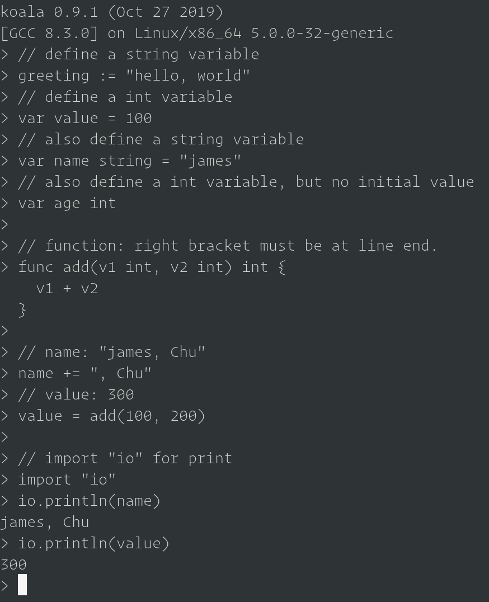

# About Koala

Koala is a fast, flexible and modularized modern language.

# Hello World

```shell
[james@host ~]$ koala
koala 0.9.1
[GCC 8.3.0] on Linux/x86_64 5.0.0-32-generic
> "Hello, World"
Hello World
>
```

# Install

```shell
git clone https://github.com/zhuguangxiang/koala-lang.git
cd koala-lang/
mkdir build
cd build/
cmake ..
make
```

The program `koala` is at `build/src/koala`, you can copy it to other places.

# Examples And Manual

## Examples

```go
// define a string variable
greeting := "hello, world"
// define a int variable
var value = 100
// also define a string variable
var name string = "james"
// also define a int variable, but no initial value
var age int

// function: right bracket must be at line end.
func add(v1 int, v2 int) int {
  v1 + v2
}

// name: "james, Chu"
name += ", Chu"
// value: 300
value = add(100, 200)

// import "io" for print
import "io"
io.println(name)
io.println(value)
```

## Execution Result



## More Examples

[Examples](https://github.com/zhuguangxiang/koala-lang/tree/master/examples) And [Tests](https://github.com/zhuguangxiang/koala-lang/blob/master/test.kl)

## Manual

[Koala Language Manual](https://github.com/zhuguangxiang/koala-lang/blob/master/docs/manual.md "Koala Language Manual")

# Feedback

You can add issues on github, or contact us by zhuguangxiang@gmail.com

If you are using `Tencent` QQ, please add QQ: 963606291
