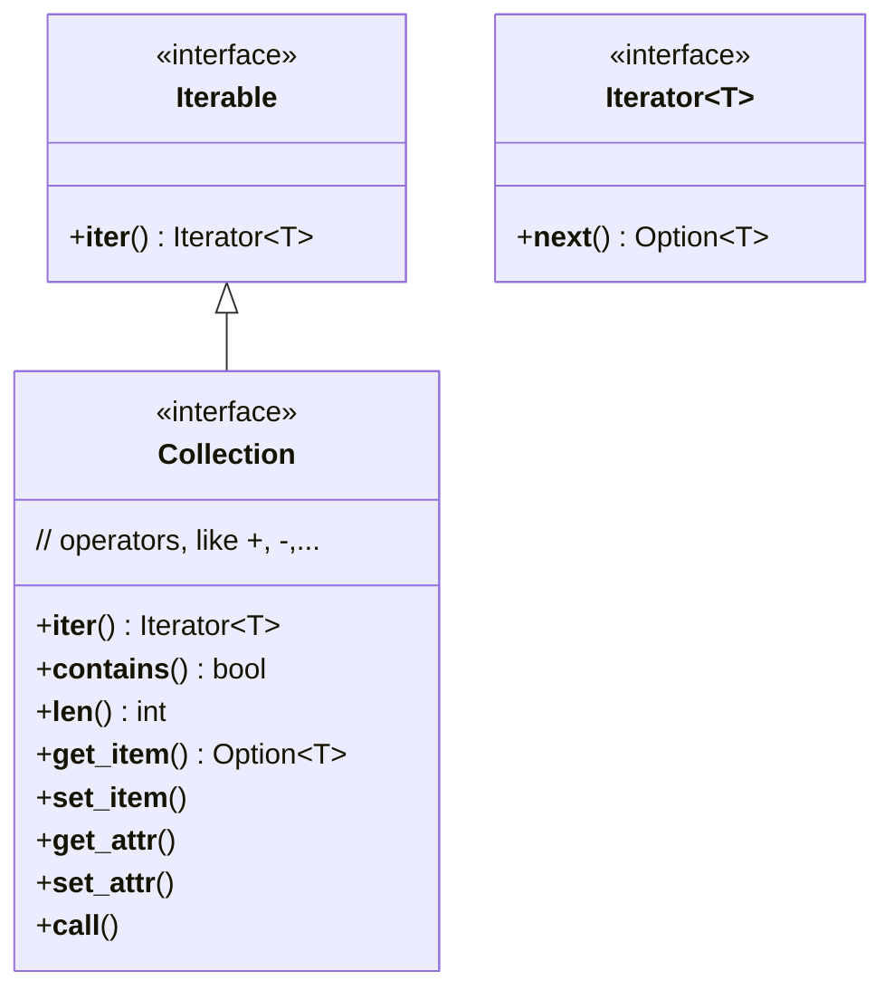

# Koala language Implementation

## About Memory
reference: https://en.wikipedia.org/wiki/Garbage_collection_(computer_science)
 - How to mange object's life cycle in c extension code?
 There is such scenario:
 VM -> C -> VM -> C ....
 - Partial Mark Sweep in C for free memory quickly
	 - which is root object?
		 - for reentrant C function, the returned value is root object.
		 - for have side-effect C function, how to do?
	 - which is objects set?
		 - Objects are allocated in current function and called functions which share the same trace stack.
 - Trace Stack in C
	 - save heap object pointer, only for non-move GC
	 - save local object pointer variable address? move objects for fragments
 - C -> C
	 - The caller is responsible for the arguments objects. The callee don't care about them.
 - escape objects
	 - When an object is used only in current c function or limited called functions, this object can be allocated in Trace Stack and is freed after current track stack freed automatically.
 - Others
## Concurrent Execution and  Multi-Thread
 - Light-Weight Thread or User space thread
 - pthread time-sharing, like python?
	- Global Lock for multi-pthread
	- each pthread is one ThreadState
	- executing the fixed number byte codes, yield to other pthread to execute
 - C code how to yield?
 - Socket and Epoll
 - Thread local reference count? global reference count?
 - Stackless light-weight thread(python generator)
## Implementation
 - Compiler
	 - generate optimized byte codes
	 - SSA inside
	 - register allocation inside
 - Language
	 - in
	```
	if a in list { ... }
	```
	 - is
	```
	if a is dict { ... }
	```
	 - as
	```
	a := b as Sub-Type
	```
	- for-in
		- translate into for int i =0; i < len; i++ or
		- slower iter() and next()
	- if-let
	```
	if let a = opt-var {
		// a is NOT none
	} else {
		// a is none, do nothing
	}
	```
	- if-let-else
	```
	if let a = opt-var else {
		// a is none, do nothing
	}
	// a is NOT none
	```
	 - with
	```
   with expr {
	   // call expr.__enter__
	   ...
	   // call expr.__exit__
   }
   with let a = expr {
	   // call a.__enter__
	   ...
	   // call a.__exit__
   }
	```
	- generic type vs enum types
		why do we need generic type? how about using enum types to replace generic type?
	- no type argument
	If an argument of a method is `object` type, it can omit the type.
	- no return type
	If a method does not explicit a return type, this method can return none or exception.

 - Virtual Machine
	- register-based vm
	- byte codes are optimized by compiler
 - Light-Weight Thread(User space thread)
	- time-shared lwthread
	- support synchronized operations
 - memory management
	- GC
		- none-moving gc: CMS
		- copy-gc?
	- c extension
		- TraceStack: a group of c function call regard as one trace stack
		- save object pointer in TraceStack for GC
		- escape objects are allocated in TraceStack
	- VM: escape objects are allocated in stack(only in one function analysis)
 - builtin module
 - io module
 - sys module
 - os module
 - builtin types
	- type(): get object type
	- int(): new int object
	- float
	- bool
	- str
	- bytes: byte array
	- list
	- dict
	- set
	- none
 - Error
	- system will raise exception
	- all exceptions are not cached, like rust panic
	- print traceback
 - Abstract Data Type
	- Sequence
	- Map
	- Iterable
	- Collection
	- Operator Override
 - Formatter
	- printf('format-string', ....)
	- Formatter(buf).fmt("fmt-str", ...)
	- string: 'hello,{}, {0}, {name}".fmt(...)
 - Buffer
	- like StringBuffer in Java
	- for print and formatter
	- other...
	- for improving performance to reduce new objects
 - magic methods
	- \_\_init\_\_
	- \_\_fini\_\_
	- \_\_entry\_\_
	- \_\_exit\_\_
	- \_\_get_item\_\_
	- \_\_set_item\_\_
	- \_\_eq\_\_
	- \_\_gt\_\_
	- \_\_len\_\_
	- \_\_contains\_\_
	- \_\_iter\_\_
	- \_\_next\_\_

## Classes


```
Iterable
├── Collection
│		├── List(ArrayList)
│		├── LinkedList
│		├── Set
│		├── Deque
│		├── PriorityQueue
|       └── ByteBuffer
└── Map(Dict)
Callable
filter()
map()
reduce()
```
## string mapping to index
## fat pointer and virtual table
## hot methods and cache
- call site cache
## tradeoff between static-typed and dynamic-typed language

## format and print

- Formatter object
The `Formatter` object with config settings and a inner buffer for print.
	- methods
		- format(fmt-str, args ...| arg dict | arg tuple)
- separator for multi-objects
- methods
	- print(objs ...)
	- printf(fmt-str, objs ...)
- String object
	The `str` object also has a format() method.
	- "hello {}, age {}".format(name, age)
	- "hello {1}, age {0}".format(age, name)
	- "hello {name:-12s}, age {age: 012d}".format(dict)
- Slice
	Don't share memory, because slice is triple(start, end, step).
	This is unlike golang. Slices in Go are contiguous pieces of memory, so you can't really create a slice with "holes" like that.
	- for ready-only and immutable
		- if there is no step, shared
		- if there is step, duplicate one
	- for mutable
		- duplicate all the time
 - object
	- can an object be none?
	- can primitive be none?
	- tradeoff:
		- all type can be none.
		- all type can NOT be none.

## symbol and lookup

- class and module
	- all symbols list(var, func, types)
	- hash map for external module linking
- relocations
	- two level relocation
	```c
	struct reloc {
		// namespace
		// for module: ./a/b; for class: ./a/b.Foo
		const char *ns;
		// symbols
		vector syms;
	};
	struct symbol {
		// symbol name
		const char *name;
		// Object: VarObject/CodeObject/CFuncObject
		Object *obj;
	};
	```
- instruction
	All related with relocations instructions have the same arguments.
	- get_global
	OP_GET_GLOBAL 0, 1
	- get_attr:
	OP_GET_ATTR 0, 1
	- call:
	OP_CALL 0, 1
	- call_method:
	OP_CALL_METHOD 0, 1
	```
	i = int(100)
	fn = i.__str__ => get_method
	print(i.real)
	import sys
	fn = sys.print => get_function
	encoding = sys.encoding => get_attr
	tp = typeof(i)
	let fields list[Fields] = tp.get_fields()

	class Foo {

	}

	foo = Foo("hello")
	foo.hello      // bound method
	foo.hello()
	foo.name
	fn = Foo.hello // unbound method
	```
- How to load/store global variable?
	- use get_global/set_global instructions
	- in __init__ function, how to do better?
	- in other functions, how to do?

- range type
	range(1,2,1) or 1...2 is half-open range.
	slice(1,2,1) or 1:2:1 is half-open slice which is only used in []
